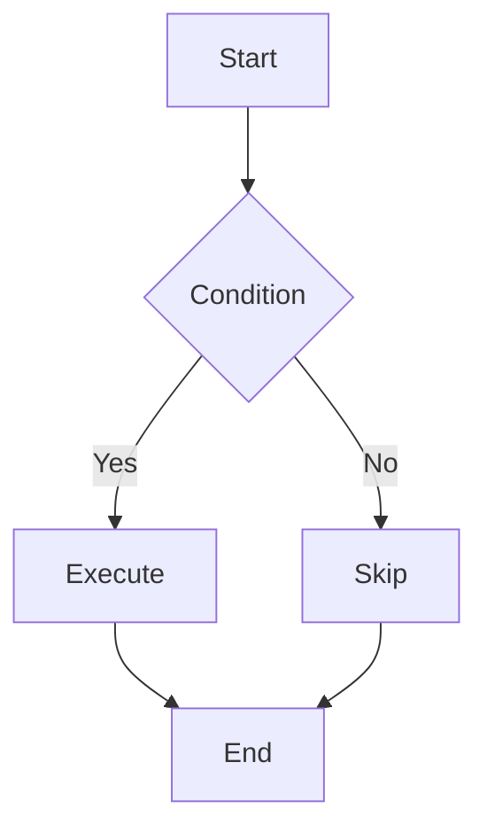
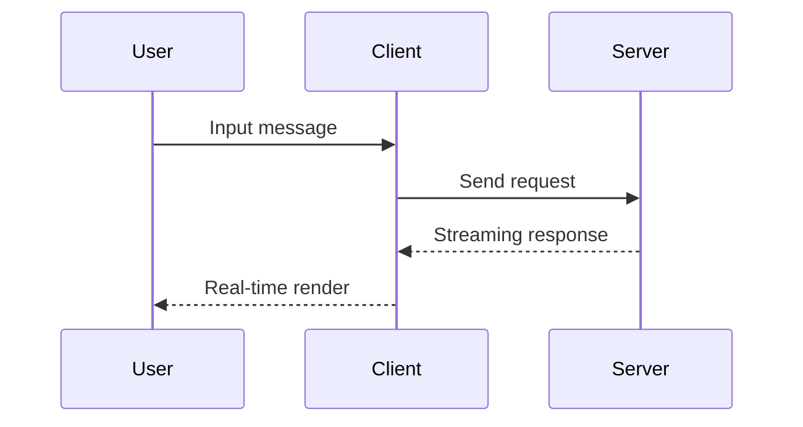

# 🚀 Incremark Vue Example

Welcome to **Incremark**! An incremental Markdown parser designed for AI streaming output.

## 📋 Features

- **Incremental Parsing**: Only parse new content, saving 90%+ CPU overhead
- **Mermaid Charts**: Support for flowcharts, sequence diagrams, etc.
- **LaTeX Formulas**: Math formula rendering support
- **GFM Support**: Tables, task lists, strikethrough, etc.

## 📐 Math Formulas

Inline formula: The mass-energy equation $E = mc^2$ is one of the most famous formulas in physics.

Block formula - Euler's formula:

$$
e^{i\pi} + 1 = 0
$$

Quadratic formula:

$$
x = \frac{-b \pm \sqrt{b^2 - 4ac}}{2a}
$$

## 📊 Mermaid Charts

### Flowchart



### Sequence Diagram



## 💻 Code Example

```typescript
import { useIncremark, Incremark } from '@incremark/vue'
import { math } from 'micromark-extension-math'
import { mathFromMarkdown } from 'mdast-util-math'

const { append, finalize } = useIncremark({
  gfm: true,
  extensions: [math()],
  mdastExtensions: [mathFromMarkdown()]
})
```

## 📊 Performance Comparison

| Metric | Traditional | Incremark | Improvement |
|--------|-------------|-----------|-------------|
| Parse Volume | ~500K chars | ~50K chars | 90% ↓ |
| CPU Usage | High | Low | 80% ↓ |
| Frame Rate | Laggy | Smooth | ✅ |

## 📝 Task List

- [x] Core parser
- [x] Vue 3 integration
- [x] Mermaid charts
- [x] LaTeX formulas
- [ ] React integration

> 💡 **Tip**: Incremark's core advantage is **parsing-level incrementalization**, not just render-level optimization.

**Thanks for using Incremark!** 🙏

