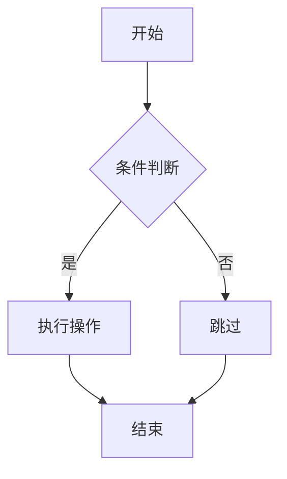
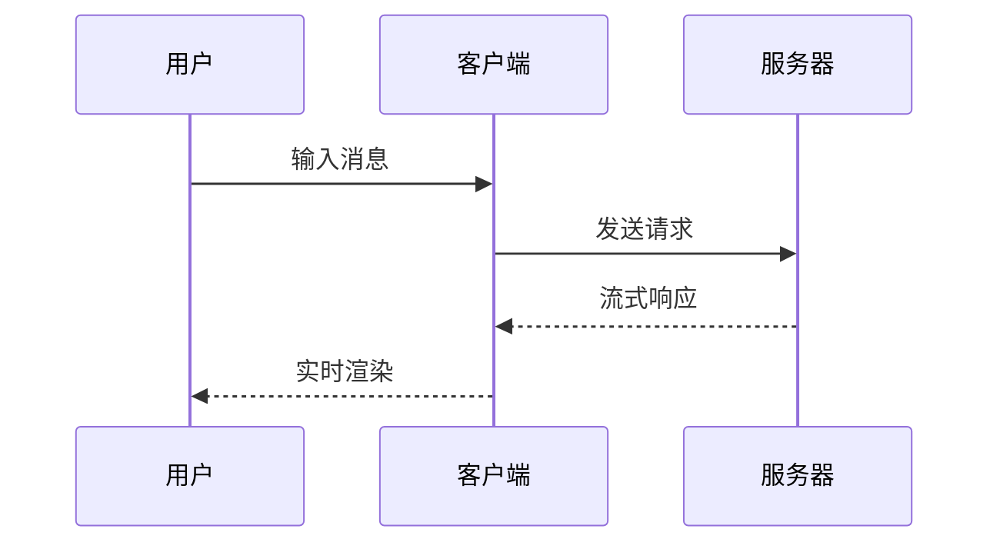

# 🚀 Incremark Vue 示例

欢迎使用 **Incremark**！这是一个专为 AI 流式输出设计的增量 Markdown 解析器。

## 📋 功能特点

- **增量解析**：只解析新增内容，节省 90% 以上的 CPU 开销
- **Mermaid 图表**：支持流程图、时序图等
- **LaTeX 公式**：支持数学公式渲染
- **GFM 支持**：表格、任务列表、删除线等

## 📐 数学公式

行内公式：质能方程 $E = mc^2$ 是物理学中最著名的公式之一。

块级公式 - 欧拉公式：

$$
e^{i\pi} + 1 = 0
$$

二次方程的求根公式：

$$
x = \frac{-b \pm \sqrt{b^2 - 4ac}}{2a}
$$

## 📊 Mermaid 图表

### 流程图



### 时序图



## 💻 代码示例

```typescript
import { useIncremark, Incremark } from '@incremark/vue'
import { math } from 'micromark-extension-math'
import { mathFromMarkdown } from 'mdast-util-math'

const { append, finalize } = useIncremark({
  gfm: true,
  extensions: [math()],
  mdastExtensions: [mathFromMarkdown()]
})
```

## 📊 性能对比

| 指标 | 传统方式 | Incremark | 提升 |
|------|----------|-----------|------|
| 解析量 | ~50万字符 | ~5万字符 | 90% ↓ |
| CPU 占用 | 高 | 低 | 80% ↓ |
| 渲染帧率 | 卡顿 | 流畅 | ✅ |

## 📝 任务清单

- [x] 核心解析器
- [x] Vue 3 集成
- [x] Mermaid 图表
- [x] LaTeX 公式
- [ ] React 集成

> 💡 **提示**：Incremark 的核心优势是**解析层增量化**，而非仅仅是渲染层优化。

**感谢使用 Incremark！** 🙏

